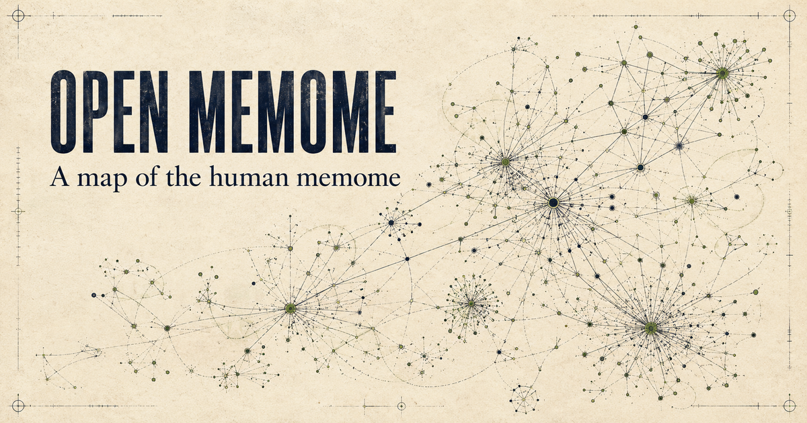

# Open Memome

**A public, evidence-based map of the memes humans transmit.**

[Explore the map](https://open-memome.cocoa-toast-3272.chatgpt.site) · [Propose a meme](https://github.com/open-memome/open-memome/issues/new?template=meme-candidate.yml) · [Review the queue](https://github.com/open-memome/open-memome/issues) · [Read the method](METHODOLOGY.md)



## What is a memome?

A **memome** is the set of memes present in a population, together with their variants and relationships.

A meme is a learned cultural unit that recurs in recognizable form: a belief, narrative, rule, practice, frame, symbol, technique, style, slogan, or joke. A memome is the larger system those units form.

## Why this exists

Ideas spread, mutate, reinforce one another, and sometimes trap people inside intellectual basins. We have many catalogues of books, beliefs, trends, and internet memes. We do not have a shared map that connects cultural units across domains and shows the evidence for how they move.

Open Memome began as a response to [Alexander Wissner-Gross's Human Memome Project challenge in a Moonshots episode](https://youtu.be/TaJH0D2FKN8?t=3342): map memes and mind viruses, then measure how they propagate through time. This repository is an independent, open-source first pass at that challenge. The semantic map works today; cross-perspective validation and time-series propagation remain on the roadmap.

## Inclusion criteria

Open Memome evaluates each proposed meme against five checks:

1. **Transmitted:** learned from another person, group, artifact, or system.
2. **Recognizable:** the copied content can be stated in one neutral sentence.
3. **Recurrent:** found in at least two independent occurrences.
4. **Variable:** able to change while remaining recognizably related.
5. **Traceable:** supported by dated evidence of movement or persistence.

People, products, organizations, events, places, and broad subjects are usually carriers or contexts. Popularity alone does not make something a meme.

These checks are an operational synthesis, not a claimed scientific consensus. Their basis and limitations are documented in [METHODOLOGY.md](METHODOLOGY.md).

## How to contribute

Choose one small, reviewable task:

- [Propose a meme](https://github.com/open-memome/open-memome/issues/new?template=meme-candidate.yml)
- [Add evidence to a record](https://github.com/open-memome/open-memome/issues/new?template=evidence.yml)
- [Challenge a decision](https://github.com/open-memome/open-memome/issues/new?template=dispute.yml)
- [Fix the code or data](CONTRIBUTING.md)

At this stage, feedback on the inclusion test, semantic layout, and how dated observations should measure propagation is especially useful.

New accepted contributions keep their sources, discussion, reviewer rationale, and version history. Discovery leads never count as scoped records and remain visibly unassessed until they pass review.

GitHub is the public contribution ledger for the alpha. A later validation layer will borrow [Community Notes' cross-perspective principle](https://communitynotes.x.com/guide/en/about/challenges), rather than treating raw vote totals as consensus, once enough independent review history exists.

## Current status

Open Memome is an early public alpha. The semantic canvas and a small documented corpus work today. Here, `documented` means that at least two dated sources are attached; it does not mean that community review is complete. The default view also includes a balanced sample of high-signal discovery leads, shown as hollow circles. Thousands of other catalogue matches remain in the review backlog. Counts describe coverage work, not verified memes.

Bubble size currently uses Wikimedia sitelinks as a reproducible long-run footprint proxy. It does not measure present-day virality. Records without a comparable reach source remain explicitly unscored.

## Repository map

- `app/`: interface, reviewed records, and generated map data
- `scripts/`: import, mapping, and validation pipelines
- `public/memome-candidates.*`: discovery dataset exports
- `METHODOLOGY.md`: scope, evidence rules, metrics, and limitations
- `DATA_MODEL.md`: record types and required fields
- `GOVERNANCE.md`: roles, decisions, disputes, and releases
- `CONTRIBUTING.md`: contribution workflow

## Development

```bash
npm install
npm run dev
```

Before opening a pull request:

```bash
npm run validate:data
npm run lint
npm test
```

Code is licensed under the [MIT License](LICENSE). Project-authored data is released under [CC0 1.0](DATA_LICENSE.md). Imported records retain their source attribution and licence.
